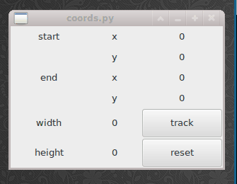

coords
======

A quick pygtk application to help determine coordinates for windows, so it's easier
to come up with coordinates for [byzanz-record](https://git.gnome.org/browse/byzanz/)

why?
====

For fun.

example
=======

